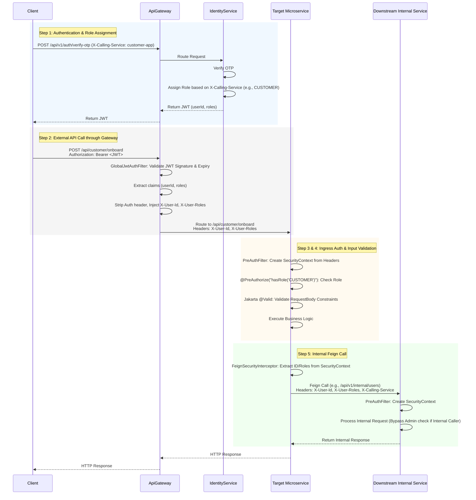

# Microservice Architecture Flow Diagram

This document provides a detailed flow diagram of the microservice architecture, including how authentication and authorization are handled at every step.

## Authentication & Authorization Flow

The entire ecosystem is protected by a unified authentication and authorization mechanism, ensuring that external users (Customers, Restaurant Brands/Outlets, and Delivery Executives) are properly identified and their access is strictly controlled based on their roles.

### Step 1: User Onboarding and Identity Creation
1. **User Request**: A user (Customer, Delivery Executive, or Restaurant Owner) attempts to onboard via their respective application.
2. **Identity Service OTP Initiation**: The client app makes a request to the IdentityService to send an OTP to the user's phone number.
3. **OTP Verification**: The user submits the OTP to the IdentityService via the `/api/v1/auth/verify-otp` endpoint, along with the `X-Calling-Service` header indicating the application they are using (e.g., `customer-app`, `delivery-app`, `restaurant-app`).
4. **Role Assignment**: 
   - Upon successful OTP verification, the IdentityService checks if the user exists.
   - If the user is new, they are registered.
   - The IdentityService reads the `X-Calling-Service` header. If it's a new user, it automatically assigns a role (`CUSTOMER`, `DELIVERY`, or `RESTAURANT`) based on the calling application.
5. **JWT Issuance**: The IdentityService generates a JWT containing the user's UUID and roles, and returns it to the client.

### Step 2: External API Request via ApiGateway
1. **Client Request**: The client application makes an API request to a specific service (e.g., `POST /api/customer/onboard`) and includes the JWT in the `Authorization: Bearer <token>` header.
2. **ApiGateway Interception**: All external requests are routed through the ApiGateway.
3. **GlobalJwtAuthFilter**: 
   - The ApiGateway's `GlobalJwtAuthFilter` intercepts the request.
   - It validates the JWT signature and expiration using the shared JWT secret.
   - It extracts the `userId`, `roles`, and `phoneNumber` from the JWT claims.
4. **Header Propagation**:
   - The ApiGateway strips the `Authorization` header to prevent the raw JWT from being forwarded.
   - It injects new headers into the downstream request:
     - `X-User-Id`: The user's UUID.
     - `X-User-Roles`: A comma-separated list of the user's roles.
     - `X-User-Phone`: The user's phone number.
   - The request is then routed to the target microservice based on the configured route paths.

### Step 3: Microservice Ingress and Authorization
1. **Request Received**: The downstream microservice (e.g., CustomerApplication) receives the request with the injected headers (`X-User-Id`, `X-User-Roles`).
2. **PreAuthFilter**:
   - The microservice's `PreAuthFilter` extracts the `X-User-Id` and `X-User-Roles` headers.
   - It creates a Spring Security `UsernamePasswordAuthenticationToken` using the `userId` as the principal and maps the roles to `SimpleGrantedAuthority`.
   - The authentication token is set in the `SecurityContextHolder`.
3. **Method-Level Security**:
   - The REST controller endpoint is protected by `@PreAuthorize` annotations.
   - Example: `@PreAuthorize("hasRole('CUSTOMER')")`.
   - Spring Security evaluates the `@PreAuthorize` expression against the authorities in the `SecurityContext`.
   - If the user lacks the required role, a `403 Forbidden` response is returned.

### Step 4: Input Validation
1. **Validation Constraints**: 
   - Before executing the business logic, the Spring Boot framework intercepts the request payload (`@RequestBody`).
   - Because the payload is annotated with `@Valid`, the framework checks the Jakarta validation constraints (e.g., `@NotBlank`, `@NotNull`, `@Positive`) defined in the request DTO.
   - If validation fails, a `400 Bad Request` is immediately returned with the validation error details.

### Step 5: Inter-Service Communication (Internal Calls)
When a microservice needs to communicate with another microservice (e.g., CustomerApplication calling IdentityService or RestaurantApplication):
1. **Feign Client Invocation**: The service uses an OpenFeign client to make the HTTP call.
2. **FeignSecurityInterceptor**:
   - A global `RequestInterceptor` intercepts the outgoing Feign request.
   - It extracts the current user's ID and roles from the `SecurityContext`.
   - It injects the `X-User-Id` and `X-User-Roles` headers into the outgoing internal request, propagating the user's identity to the downstream service.
   - It also injects an `X-Calling-Service` header to identify the calling microservice.
3. **Internal Endpoints**:
   - Certain endpoints (like `/api/v1/internal/users/**` in IdentityService) are designated for internal use.
   - These endpoints might not require specific user roles (like `ADMIN`) if they are called by another trusted microservice (identified by the `X-Calling-Service` header). The ApiGateway configuration blocks external access to these `/api/*/internal/**` paths.

### Step 6: WebSocket Security (Real-Time Updates)
For real-time features like delivery tracking:
1. **Connection Initiation**: The client initiates a WebSocket connection (e.g., to `/ws-delivery`).
2. **JWT Parameterization**: Since WebSockets cannot easily send HTTP headers during the handshake, the client includes the JWT as a query parameter (`?token=<jwt>`).
3. **ChannelInterceptor**:
   - The microservice's WebSocket configuration includes a `ChannelInterceptor` (e.g., `JwtChannelInterceptor`).
   - During the `CONNECT` message, the interceptor extracts the token from the query parameters or native headers.
   - It validates the JWT and extracts the `userId` and `roles`.
   - It creates a `UsernamePasswordAuthenticationToken` and assigns it to the `StompHeaderAccessor` user property.
4. **Subscription Authorization**:
   - When the client attempts to subscribe to a topic (e.g., `/topic/driver/{driverId}`), a destination-based authorization check is performed.
   - The system verifies that the authenticated user (`principal.getName()`) matches the `{driverId}` in the topic path, ensuring users can only subscribe to their own data streams.

---

## Detailed Sequence Diagram

